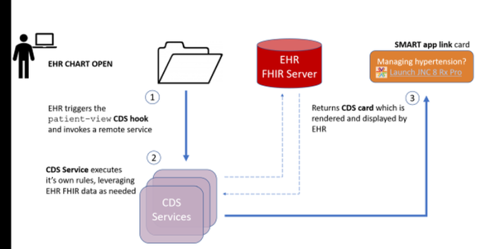
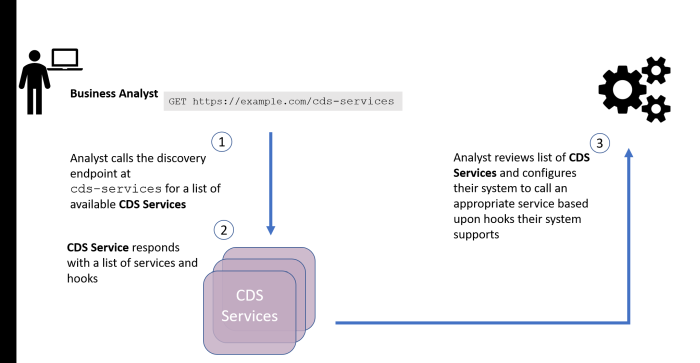
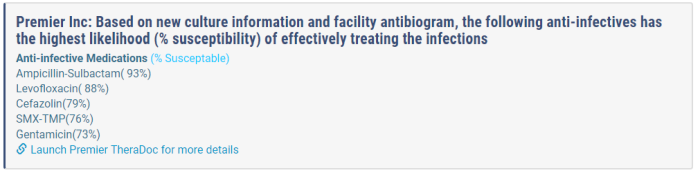
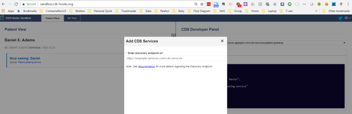
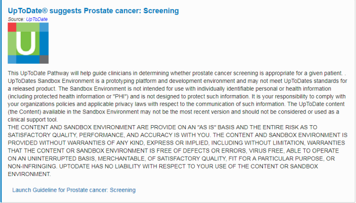

- [Heading](#Overview)
  * [Sub-heading](#Building-a-CDS-Service)
    + [Sub-sub-heading](#Endpoint-for-discovery)
    + [Sub-sub-heading](#Develop-a-service)
    + [Sub-sub-heading](#Create-a-SMART-App)
    + [Sub-sub-heading](#Test-service-with-a-sandbox)
  * [Sub-heading](#Building an EHR Service)
    + [Sub-sub-heading](#Calls discovery endpoint)
    + [Sub-sub-heading](#Invoke service on patient-view hook)
    + [Sub-sub-heading](#Support for FHIR resources on request or prefetch)
    + [Sub-sub-heading](#Exposed non-secured FHIR server)
    + [Sub-sub-heading](#Render card)
    + [Sub-sub-heading](#Launch SMART app)
  * [Sub-heading](#Try it out with WK CE Pathways CDS Hook Prototype )
  * [Sub-heading](#Next Steps)
    
    
    
    
# Overview 

[CDS hooks](http://cds-hooks.org/#overview) is a vendor agnostic remote decision support specification. The specification defines a series of 'hooks' which provide information, or access to a SMART application, within a user's standard workflow. 

A CDS hooks scenario typically includes two main actors: EHR FHIR Server, and a CDS Service. Below is an example interaction for the `patient-view` hook.

From the returned **CDS card** the EHR may launch the SMART app following the guidance from [SMART on FHIR](http://docs.smarthealthit.org/authorization/).

This tutorial will define each of the actors and provide details for implementing the `patient-view` hook. 

CDS hooks is an open source (Apache) initiative launched by the [SMART](https://smarthealthit.org/) team.

If you are interested in deploying an EHR service jump to [building an EHR service](#building-an-ehr-service).

## Building a CDS Service
A CDS service is an external service that responds to EHR requests through cards. There are several steps to setting up a CDS service: 
1. Create an endpoint for discovery
1. Develop a service
1. Test service with a [sandbox](http://sandbox.cds-hooks.org/)
1. Create a SMART app (or [borrowed](https://apps.smarthealthit.org/apps/pricing/open-source))
1. Test service + SMART app with an EHR

### Endpoint for discovery
The CDS service must provide a stable endpoint for the EHR to discover the available services. A system must expose their services at `{baseUrl}/cds-services`. A service endpoint that supports the `patient-view` hook may return:

    {
      "services": [
        {
          "hook": "patient-view",
          "name": "Static CDS Service Example",
          "description": "An example of a CDS service that returns a card with SMART app recommendations.",
          "id": "static-patient-view",
          "prefetch": {
            "patientToGreet": "Patient/{{Patient.id}}"
          }
        }
      ]
    }

The attributes available to describe a CDS services is documented in the [CDS hooks specification](http://cds-hooks.org/#discovery).

 
### Develop a service
With a stable open end point available it's time to complete development of a service. A CDS service could provide **information**, a **suggestion**, or a **SMART app** link. The focus of the Argonaut CDS hooks effort is a `patient-view` hook launching a SMART app so this guide will focus on the SMART app link.

A CDS `patient-view` hook could return the following card:

    {
      "cards": [
        {
          "summary": "SMART App Success Card",
          "indicator": "success",
          "detail": "This is an example SMART App success card.",
          "source": {
            "label": "Static CDS Service Example",
            "url": "https://example.com"
          },
          "links": [
            {
              "label": "SMART Example App",
              "url": "https://smart.example.com/launch",
              "type": "smart"
            }
          ]
        }
      ]
     }

### Create a SMART App
You may already have created a SMART app prior to this step, but just in case this is a reminder. The SMART app is launched from the link returned in your service. If you want to borrow a SMART app, check out the [app gallery](https://apps.smarthealthit.org/apps/pricing/open-source).

### Test service with a sandbox
The CDS hooks initiative provides a publicly available [sandbox](http://sandbox.cds-hooks.org/) to test your service. 

Select the configure hooks:  

Delete the existing hooks, and then do a quick add with a reference to your CDS service:  

After testing with the sandbox, you are ready to connect with an EHR service.

## Building an EHR Service
Build out following sections:
1. Calls discovery endpoint 
1. Invoke service on patient-view 
1. Support for FHIR resources on request (context or pre-fetch)
1. Exposed non-secured FHIR server
1. Render card
1. Launch SMART app 
1. Tested with external CDS service

### Calls discovery endpoint 
The CDS discovery endpoint provides the list of services a CDS provider supports, and the hooks a service should be invoked on. An EHR may configure their system to support a set of hooks at a certain location in their users work flow, or build a dynamic capability to interact with a CDS Service provider within a work flow. For the best end-user experience, this guide recommends a business analyst configure which hooks an EHR will support. 

Below is an example work flow where a business analyst accesses this list of available services by calling `GET https://example.com/cds-services` and then configures them in the system. 

This image captures a business analyst reviewing services from one CDS provider. A business analyst may review services from multiple providers and configure appropriate services per user profiles.

### Invoke service on patient-view hook
The patient-view hook is invoked when a patient chart is opened. It's one of the most basic since the logic doesn't have any prior workflow dependencies. The service called on the patient-view hook could be dependent on patient characteristics, for example: sex, problems in problems list, active medications, etc. The current version of the CDS Hooks specification allows the EHR to decide which characteristics to consider. 

### Support for FHIR resources on request or prefetch
Often a CDS service will require additional information from the EHR to perform the decision support logic, or determine the appropriate SMART app to return. Prefetch provides the EHR the capability to pass a resource when invoking a service. For example, with a patient resource included a service could do a geography search for potential environmental risk factors. Below is an example request invoked on patient-view with a patient included: 

    {  
       "hookInstance":"d1577c69-dfbe-44ad-ba6d-3e05e953b2ea",
       "fhirServer":"http://hooks.smarthealthit.org:9080",
       "hook":"patient-view",
       "fhirAuthorization":{  
          "access_token":"some-opaque-fhir-access-token",
          "token_type":"Bearer",
          "expires_in":300,
          "scope":"patient/Patient.read patient/Observation.read",
          "subject":"cds-service4"
       },
       "user":"Practitioner/example",
       "context":{  
          "patientId":"1288992",
          "encounterId":"89284"
       },
       "prefetch":{  
          "p":{  
             "resourceType":"Patient",
             "gender":"male",
             "birthDate":"1974-12-25",
             "...":"<snipped for brevity>"
          },
          "a1c":{  
             "resourceType":"Bundle",
             "type":"searchset",
             "entry":[  
                {  
                   "resource":{  
                      "resourceType":"Observation",
                      "code":{  
                         "coding":[  
                            {  
                               "system":"http://loinc.org",
                               "code":"4548-4",
                               "display":"Hemoglobin A1c"
                            }
                         ]
                      },
                      "...":"<snipped for brevity>"
                   }
                }
             ]
          }
       }
    }

In some cases, additional information beyond what is included in the prefetch maybe required. The CDS service can request additional information using the FHIR REST APIs:

    {
      "prefetch": {
        "p": "Patient/{{context.patientId}}",
        "a1c": "Observation?patient={{context.patientId}}&code=4548-4",
        "u": "Practitioner/{{user}}"
      }
    }

It is recommended FHIR servers implement, CDS Services follow, the guidance in the [Argonaut Data Query Guide (DSTU2)](http://www.fhir.org/guides/argonaut/r2/) or [HL7 US Core (STU3)](http://hl7.org/fhir/us/core/index.html) implementation guides when retrieving additional resources. Each profile page within these implementation guides includes queries FHIR servers are required to support. 

### Exposed non-secured FHIR server
A non secured FHIR server is important to support testing with a CDS service. When the EHR moves a hook implementation to production the system to is expected to follow the security guidelines in the spec

### Render card
The CDS service will provide a response in the form a of a 'card'. Your EHR needs to be able to display the card.

Example card JSON: 

    {
      "cards": [
        {
          "summary": "Premier Inc:  Based on new culture information and facility antibiogram, the following anti-infectives has the highest likelihood (% susceptibility) of effectively treating the infections ",
          "indicator": "info",
          "detail": "<Table><tr><td><strong>Anti-infective Medications </strong>(% Susceptable)</td></tr><TR><TD>Ampicillin-Sulbactam( 93%) </TD></TR><TR><TD>Levofloxacin( 88%) </TD></TR><TR><TD>Cefazolin(79%) </TD></TR><TR><TD>SMX-TMP(76%) </TD></TR><TR><TD>Gentamicin(73%) </TD></TR></Table>",
          "source": {
            "name": "Premier Inc",
            "url": null
          },
          "links": [
            {
              "label": "Launch Premier TheraDoc for more details",
              "url": "http://premiercdsapps-env.us-east-1.elasticbeanstalk.com/CDS_Hooks/antibiogramlink?hookinstance=9ae4bc55-2ccd-469b-b5cc-33e23d983998",
              "type": "absolute"
           }
          ]
        }
      ]
    }

Example card rendered:  

### Launch SMART app 

For some CDS services the end step will just display the card. For the patient-view hook discussed here, we are focused on launching a SMART app. The CDS hooks guide places no additional constraints for launching a SMART app beyond those from SMART on FHIR.

## Try it out with WK CE Pathways CDS Hook Prototype 

1. Call discovery endpoint [End Point](https://prototypes.utdlab.com/argonaut/cds-services) to make sure discovery endpoint is up and running.  
1. Log into HSPC Sandbox and Launch CDS Hooks Sandbox app
1. Select Patient Joshua Hill - SMART-613876
1. Add WK CE Pathway CDS Service [End Point](https://prototypes.utdlab.com/argonaut/cds-services)  to the CDS Hooks Sandbox     

1. View Rendered Card Response   

## Next Steps
Through this tutorial we have:

1. Completed CDS Hooks overview.
1. Tried CDS Hooks -  HSPC&rsquo;s sandbox & CDS Hooks demo app

We&rsquo;ve configured a very basic patient-view hook that meets the base requirements of being a CDS Hooks specification. A couple of next steps you could look at are:

1. Try calling another hook service.

We&rsquo;re excited to see what you&rsquo;ll do to roll out and scale the WK CE implementation process!
